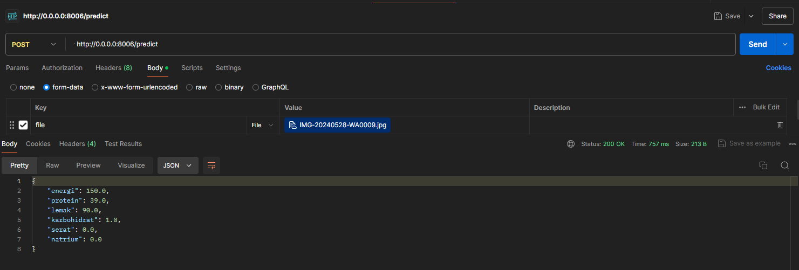

# Nutrition OCR
This API extracts nutritional information from an image of a nutrition label. The supported image formats are `.jpg`, `.jpeg`, `.png`, and `.heic`
## Running the Models

These steps will guide you through setting up the environment, installing dependencies, and running the NutriLens Grade Models.

### **1. Set Up the Environment**

* Install `virtualenv`:

```bash
pip install virtualenv
```
* Set the python version:
```bash
virtualenv --python=python3.10 .venv
```
* Create Environment
```bash
python -m venv .venv
```
* Activate the Environment
```bash
.venv\Scripts\activate
```
* Deactivate the Environment
```bash
deactivate
```


### **2. Install the required dependencies** 
```bash
pip install -r requirements.txt
```

### **3. Test the Api use this command:**

```bash
cd app
uvicorn app:app --port 8006 
```

```text
INFO:Uvicorn running on http://localhost:8006 (Press CTRL+C to quit)
```
This indicates that your FastAPI application is running and can be accessed at `http://localhost:8006` in your browser.

### **4. Built Docker Image**
```bash
docker build -t nutri-ocr .
```

### **5. Run Docker Container**
```bash
docker run -d -p 8006:8006 nutri-ocr
```

### **6. Accepted File Formats**
```text
file.jpg or file.png or file.jpg or file.jpeg or file.heic
```
Note :
* Ensure that the image file format is one of the supported formats listed above.

### **7. Output**
```json
{
  "takaran_saji": 0, 
  "energi": 0,
  "protein": 0,
  "lemak": 0,
  "karbohidrat": 0,
  "serat": 0,
  "natrium": 0
}
```
#### Description of Output Fields :
* takaran_saji: int
* energi: float
* protein: float
* lemak: float
* karbohidrat: float
* serat: float
* natrium: float

Note:
* The output values for takaran_saji, energi, protein, lemak, karbohidrat, serat, and natrium are initialized to 0. These values will be replaced with the actual extracted values from the nutrition label.

### **8. Testing API with Postman**

